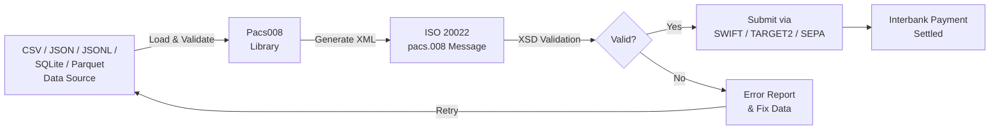
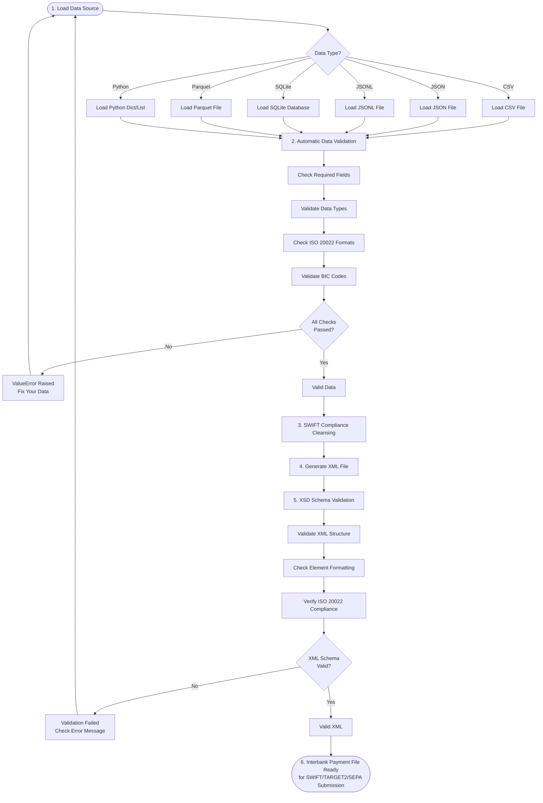
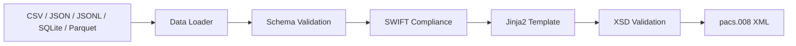

# Pacs008: Automate ISO 20022-Compliant Interbank Payment File Creation

![Pacs008 banner][banner]

## Enterprise-Grade ISO 20022 Interbank Payment File Generation

[![PyPI Version][pypi-badge]][03]
[![Python Versions][python-versions-badge]][03]
[![PyPI Downloads][pypi-downloads-badge]][07]
[![Licence][licence-badge]][01]
[![Codecov][codecov-badge]][06]
[![Tests][tests-badge]][tests-url]
[![Quality][quality-badge]][quality-url]
[![Documentation][docs-badge]][docs-url]

> **Latest Release: v0.0.1** - FI-to-FI credit transfer XML generation, SWIFT compliance, FastAPI REST API, and 13 pacs.008 versions.
> [See what's new →][release-001]

## Overview

**Pacs008** is an open-source Python library that you can use to create **ISO
20022-compliant pacs.008 FI-to-FI Customer Credit Transfer XML messages** from
your **CSV files**, **JSON files**, **JSONL files**, **SQLite databases**, or
**Apache Parquet files**.

- **Website:** <https://pacs008.com>
- **Source code:** <https://github.com/sebastienrousseau/pacs008>
- **Bug reports:** <https://github.com/sebastienrousseau/pacs008/issues>

The library focuses specifically on **Payments Clearing and Settlement Messages**,
commonly known as **Pacs**. In a simplified way, a **pacs.008** is a message
that carries credit transfer instructions between financial institutions — the
interbank counterpart to pain.001. It powers settlement across TARGET2, SWIFT gpi,
and SEPA networks.

**Key Features:**

- **Mandatory Data Validation:** Ensures all payment files are
  ISO 20022-compliant before creation
- **Multi-source Support:** Works with CSV, JSON, JSONL, SQLite, and
  Parquet data sources
- **Automatic XSD Validation:** Validates generated XML against
  ISO 20022 schemas
- **Comprehensive Testing:** 1,400+ tests with 100% branch coverage
  ensuring reliability
- **Secure by Design:** Uses `defusedxml` to prevent XXE attacks
  and implements path traversal protection
- **Type-Safe:** Full type hints for better IDE support and type
  checking with mypy (strict mode)
- **SWIFT Compliance:** Charset cleansing, field length enforcement,
  and silent rejection prevention
- **13 ISO 20022 Versions Supported:** Supports all 13 FI-to-FI
  Customer Credit Transfer versions: pacs.008.001.01 through
  pacs.008.001.13
- **Production-Ready:** Used in production environments for SWIFT gpi,
  TARGET2, and SEPA interbank settlements

As of today, the library is designed to be compatible with the:

- **FI-to-FI Credit Transfer V01 (pacs.008.001.01):** Basic interbank
  credit transfer with BIC identification
- **FI-to-FI Credit Transfer V02 (pacs.008.001.02):** Enhanced with
  additional optional fields for settlement details
- **FI-to-FI Credit Transfer V03 (pacs.008.001.03):** Migrated to BICFI
  identification for financial institutions
- **FI-to-FI Credit Transfer V04 (pacs.008.001.04):** BICFI standard with
  improved data structures
- **FI-to-FI Credit Transfer V05 (pacs.008.001.05):** Further refinements
  to the BICFI standard schema
- **FI-to-FI Credit Transfer V06 (pacs.008.001.06):** Extended schema
  with additional optional elements
- **FI-to-FI Credit Transfer V07 (pacs.008.001.07):** Focused on
  supporting enhanced settlement information
- **FI-to-FI Credit Transfer V08 (pacs.008.001.08):** Introduces UETR
  (Unique End-to-End Transaction Reference) support
- **FI-to-FI Credit Transfer V09 (pacs.008.001.09):** Extended UETR
  support with enhanced validation rules
- **FI-to-FI Credit Transfer V10 (pacs.008.001.10):** Adds mandate
  identification support
- **FI-to-FI Credit Transfer V11 (pacs.008.001.11):** Enhanced mandate
  support with improved compliance
- **FI-to-FI Credit Transfer V12 (pacs.008.001.12):** Full mandate
  support with additional data structures
- **FI-to-FI Credit Transfer V13 (pacs.008.001.13):** The latest version
  with message expiry and advanced payment features

### Version Comparison

| Version | Status | BIC Tag | UETR | Mandate | Expiry | Key Features |
|---------|--------|---------|:----:|:-------:|:------:|--------------|
| pacs.008.001.01 | ✅ Stable | `<BIC>` | — | — | — | Basic interbank transfers |
| pacs.008.001.02 | ✅ Stable | `<BIC>` | — | — | — | Enhanced settlement details |
| pacs.008.001.03 | ✅ Stable | `<BICFI>` | — | — | — | BICFI migration |
| pacs.008.001.04 | ✅ Stable | `<BICFI>` | — | — | — | BICFI standard |
| pacs.008.001.05 | ✅ Stable | `<BICFI>` | — | — | — | Schema refinements |
| pacs.008.001.06 | ✅ Stable | `<BICFI>` | — | — | — | Extended elements |
| pacs.008.001.07 | ✅ Stable | `<BICFI>` | — | — | — | Enhanced settlement |
| pacs.008.001.08 | ✅ Stable | `<BICFI>` | ✓ | — | — | UETR support |
| pacs.008.001.09 | ✅ Stable | `<BICFI>` | ✓ | — | — | Extended UETR |
| pacs.008.001.10 | ✅ Stable | `<BICFI>` | ✓ | ✓ | — | Mandate support |
| pacs.008.001.11 | ✅ Stable | `<BICFI>` | ✓ | ✓ | — | Enhanced mandates |
| pacs.008.001.12 | ✅ Stable | `<BICFI>` | ✓ | ✓ | — | Full mandates |
| pacs.008.001.13 | ✅ Latest | `<BICFI>` | ✓ | ✓ | ✓ | Message expiry |

Interbank payments typically start with a **pacs.008 credit transfer message**.
A financial institution sends it to another financial institution via a secure
network. This network could be **SWIFT**, **TARGET2**, **SEPA**, or other
clearing and settlement systems such as **CHAPS**, **Fedwire**, **CHIPS**, etc.
The message contains the debtor and creditor financial institution details,
settlement amounts, and other information required to process the interbank
credit transfer.

The **Pacs008** library reduces interbank payment processing complexity and costs
by generating ISO 20022-compliant payment files with **mandatory validation**.
These files are automatically validated before creation, eliminating the need to
create and validate them manually. This makes the payment process more efficient
and cost-effective whilst saving you time and resources and minimising the risk
of errors, ensuring accurate and seamless interbank payment processing.

**Use the Pacs008 library to simplify, accelerate, and automate your interbank
payment processing with confidence that every file is ISO 20022-compliant.**

## How It Works

### Payment Processing Flow



## Table of Contents

- [Pacs008: Automate ISO 20022-Compliant Interbank Payment File Creation](#pacs008-automate-iso-20022-compliant-interbank-payment-file-creation)
  - [Overview](#overview)
  - [Table of Contents](#table-of-contents)
  - [Features](#features)
  - [Requirements](#requirements)
  - [Installation](#installation)
    - [Install `virtualenv`](#install-virtualenv)
    - [Create a Virtual Environment](#create-a-virtual-environment)
    - [Activate environment](#activate-environment)
    - [Getting Started](#getting-started)
  - [Quick Start](#quick-start)
    - [Arguments](#arguments)
  - [Input Data Format](#input-data-format)
    - [Required Fields](#required-fields)
    - [Version-Specific Fields](#version-specific-fields)
  - [Examples](#examples)
    - [Using a CSV Data File as the source](#using-a-csv-data-file-as-the-source)
    - [Using a JSON Data File as the source](#using-a-json-data-file-as-the-source)
    - [Using a JSONL Data File as the source](#using-a-jsonl-data-file-as-the-source)
    - [Using a SQLite Data File as the source](#using-a-sqlite-data-file-as-the-source)
    - [Using a Parquet Data File as the source](#using-a-parquet-data-file-as-the-source)
    - [Using Python Data Structures (Programmatic API)](#using-python-data-structures-programmatic-api)
    - [Using the Source code](#using-the-source-code)
      - [Pacs.008.001.01](#pacs00800101)
      - [Pacs.008.001.02](#pacs00800102)
      - [Pacs.008.001.03](#pacs00800103)
      - [Pacs.008.001.04](#pacs00800104)
      - [Pacs.008.001.05](#pacs00800105)
      - [Pacs.008.001.06](#pacs00800106)
      - [Pacs.008.001.07](#pacs00800107)
      - [Pacs.008.001.08](#pacs00800108)
      - [Pacs.008.001.09](#pacs00800109)
      - [Pacs.008.001.10](#pacs00800110)
      - [Pacs.008.001.11](#pacs00800111)
      - [Pacs.008.001.12](#pacs00800112)
      - [Pacs.008.001.13](#pacs00800113)
  - [REST API (FastAPI)](#rest-api-fastapi)
  - [SWIFT Compliance](#swift-compliance)
  - [Validation](#validation)
  - [Output Files](#output-files)
  - [Architecture](#architecture)
  - [Development](#development)
  - [Troubleshooting](#troubleshooting)
  - [Documentation](#documentation)
  - [Licence](#licence)
  - [Contribution](#contribution)
  - [Acknowledgements](#acknowledgements)

## Features

### Core Functionality

- **Easy to Use:** Both developers and non-developers can easily use the library, as it requires minimal coding knowledge
- **Open Source:** The library is open source and free to use, making it accessible to everyone
- **Mandatory Data Validation:** Ensures payment file integrity and ISO 20022 compliance
  - All data sources (CSV, JSON, JSONL, SQLite, Parquet) are automatically validated
  - Invalid data raises clear `ValueError` messages indicating what needs to be fixed
  - Validates required fields, data types, and field formats
  - Prevents creation of non-compliant payment files
  - No manual validation needed—it's built into every data load operation

### Security & Quality

- **Secure:** The library prioritises security with multiple layers of protection
  - Uses `defusedxml` for secure XML parsing to prevent XXE attacks
  - Implements path traversal protection in file operations
  - Regular security audits with Bandit
  - All dependencies kept up to date to address known vulnerabilities
  - No sensitive data storage—all information remains confidential
  - OWASP Top 10 security best practices implemented
- **SWIFT Compliance:**
  - Charset validation and transliteration for SWIFT-safe characters
  - Automatic field length enforcement (msg_id max 35, names max 140)
  - Silent rejection prevention through proactive data cleansing
  - Full compliance report generation for audit trails
- **Robust Development:** Comprehensive quality assurance with
  - 1,400+ tests with 100% branch coverage across Python 3.9–3.12
  - Code formatting with Black and Ruff
  - Static type checking with mypy (strict mode)
  - Security scanning with Bandit
  - Performance benchmarks for XML generation

### Business Benefits

- **Customisable:** The library allows developers to customise the output, making it adaptable to specific business requirements and preferences
- **Scalable Solution:** The **Pacs008** library can handle varying volumes of interbank payment files, making it suitable for financial institutions of different sizes and transaction volumes
- **Time-Saving:** The automated file creation process reduces the time spent on manual data entry and file generation, increasing overall productivity
- **Seamless Integration:** As a Python package, the Pacs008 library is compatible with various Python-based applications and easily integrates into any existing projects or workflows
- **Cross-Border Compatibility:** The library supports SWIFT gpi, TARGET2, SEPA, and other clearing and settlement systems, making it versatile for use across different networks and regions
- **Improved Accuracy:** By providing precise data validation, the library reduces errors in payment file creation and processing
- **Enhanced Efficiency:** Automates the creation of interbank payment message files
- **Accelerated Processing:** Automates the process and reduces the time required to create payment files
- **Guaranteed Compliance:** Validates all payment files to meet the ISO 20022 standards
- **Simplified Workflow:** Provides a standardised payment file format for ISO 20022-compliant interbank payment messages
- **Reduced Costs:** Removes manual data entry and file generation, reducing payment processing time and errors

## Requirements

**Pacs008** works with macOS, Linux, and Windows and requires:

- **Python 3.9.2 or higher**
- **pip** (Python package installer)

### Key Dependencies

| Package | Purpose |
|---------|---------|
| `click` | Command-line interface creation |
| `defusedxml` | Secure XML parsing (protection against XXE attacks) |
| `xmlschema` | XML Schema validation |
| `rich` | Terminal output formatting |
| `jinja2` | XML template rendering |

All dependencies are automatically installed when you install Pacs008.

## Installation

We recommend creating a virtual environment to install **Pacs008**. This will
ensure that the package is installed in an isolated environment and will not
affect other projects. To install **Pacs008** in a virtual environment, follow
these steps:

### Install `virtualenv`

```sh
python -m pip install virtualenv
```

### Create a Virtual Environment

```sh
python -m venv venv
```

| Code  | Explanation                     |
| ----- | ------------------------------- |
| `-m`  | executes module `venv`          |
| `env` | name of the virtual environment |

### Activate environment

**On macOS/Linux:**
```sh
source venv/bin/activate
```

**On Windows:**
```cmd
venv\Scripts\activate
```

You'll see `(venv)` appear at the start of your command line prompt, indicating the virtual environment is active.

### Getting Started

It takes just a few seconds to get up and running with **Pacs008**. You can
install Pacs008 from PyPI with pip or your favourite package manager.

**Step 1:** Open your terminal and run the following command to install the latest version:

```sh
python -m pip install pacs008
```

**Step 2:** Verify the installation:

```sh
python -c "from pacs008 import generate_xml_string; print('Pacs008 is installed and ready to use')"
```

You should see a confirmation message indicating Pacs008 is ready to use.

**Updating Pacs008:**

If `pacs008` is already installed and you want to upgrade to the latest version:

```sh
python -m pip install -U pacs008
```

## Quick Start

After installation, you can run **Pacs008** directly from the command line. Follow these simple steps:

**Step 1:** Prepare your files

You'll need:
- **XML template file** - Contains the structure for your payment message
- **XSD schema file** - Used to validate the generated XML file
- **Data source** - Your payment instructions from:
  - CSV file (.csv)
  - JSON file (.json)
  - JSONL file (.jsonl)
  - SQLite database (.db)
  - Parquet file (.parquet)
  - Python list of dictionaries
  - Python dictionary (single transaction)

**Step 2:** Run Pacs008

```sh
pacs008 -t <xml_message_type> \
    -m <xml_template_file_path> \
    -s <xsd_schema_file_path> \
    -d <data_file_path>
```

**Real Example:**

```sh
pacs008 -t pacs.008.001.05 \
    -m pacs008/templates/pacs.008.001.05/template.xml \
    -s pacs008/templates/pacs.008.001.05/pacs.008.001.05.xsd \
    -d payments.csv
```

**Step 3:** Check the output

If successful, you'll see:
- Validation messages in your terminal
- A new ISO 20022-compliant XML file at your specified location

### Safe Validation (Dry-Run Mode)

You can validate your data against the ISO 20022 schema **without
generating an output file** using the `--dry-run` flag. This is ideal for:

- **CI/CD Pipelines:** Pre-flight validation in automated builds
- **Data Quality Checks:** Verify payment data before batch processing
- **Template Development:** Test XML templates and schemas without file clutter
- **Pre-Commit Hooks:** Validate data before committing to version control

**Command:**

```sh
pacs008 -t pacs.008.001.05 \
    -m pacs008/templates/pacs.008.001.05/template.xml \
    -s pacs008/templates/pacs.008.001.05/pacs.008.001.05.xsd \
    -d payments.csv \
    --dry-run
```

**Output:**

```plaintext
All validations passed (--dry-run: no XML generated)
```

**Exit Codes:**

- `0` - Validation succeeded (safe to proceed)
- `1` - Validation failed (data or schema errors detected)

### Arguments

When running **Pacs008**, you will need to specify four arguments:

- An `xml_message_type`: This is the type of XML message you want to generate.

  The currently supported types are:

  - pacs.008.001.01
  - pacs.008.001.02
  - pacs.008.001.03
  - pacs.008.001.04
  - pacs.008.001.05
  - pacs.008.001.06
  - pacs.008.001.07
  - pacs.008.001.08
  - pacs.008.001.09
  - pacs.008.001.10
  - pacs.008.001.11
  - pacs.008.001.12
  - pacs.008.001.13

- An `xml_template_file_path`: This is the path to the XML template file you are
  using that contains variables that will be replaced by the values in your data
  file.

- An `xsd_schema_file_path`: This is the path to the XSD schema file you are
  using to validate the generated XML file.

- A `data_file_path`: This is the path to the CSV, JSON, JSONL, SQLite, or
  Parquet data file you want to convert to XML format.

Options: `--dry-run` (validate only), `--verbose` (detailed output).

## Input Data Format

Before using **Pacs008**, prepare your data file with the payment data. The data
file must include specific fields that map to ISO 20022 pacs.008 elements.

### Required Fields

| Field | Description | Example |
|-------|-------------|---------|
| `msg_id` | Message identifier (max 35) | `MSG-2026-001` |
| `creation_date_time` | ISO 8601 datetime | `2026-01-15T10:30:00` |
| `nb_of_txs` | Number of transactions | `1` |
| `settlement_method` | CLRG, INDA, COVE, or INGA | `CLRG` |
| `interbank_settlement_date` | Settlement date | `2026-01-15` |
| `end_to_end_id` | End-to-end identifier (max 35) | `E2E-INV-001` |
| `tx_id` | Transaction identifier | `TX-001` |
| `interbank_settlement_amount` | Amount | `25000.00` |
| `interbank_settlement_currency` | ISO 4217 currency code | `EUR` |
| `charge_bearer` | DEBT, CRED, SHAR, or SLEV | `SHAR` |
| `debtor_name` | Debtor name (max 140) | `Acme Corp` |
| `debtor_agent_bic` | Debtor bank BIC (8 or 11 chars) | `DEUTDEFF` |
| `creditor_agent_bic` | Creditor bank BIC (8 or 11 chars) | `COBADEFF` |
| `creditor_name` | Creditor name (max 140) | `Widget SA` |

### Version-Specific Fields

| Field | Available From | Description |
|-------|----------------|-------------|
| `uetr` | v08+ | UUID v4 (36 chars) |
| `mandate_id` | v10+ | Mandate identifier (max 35) |
| `expiry_date_time` | v13 | Message expiry datetime |

**Sample CSV File:**

```csv
msg_id,creation_date_time,nb_of_txs,settlement_method,interbank_settlement_date,end_to_end_id,tx_id,interbank_settlement_amount,interbank_settlement_currency,charge_bearer,debtor_name,debtor_account_iban,debtor_agent_bic,creditor_agent_bic,creditor_name,creditor_account_iban,remittance_information
MSG-2026-001,2026-01-15T10:30:00,1,CLRG,2026-01-15,E2E-INV-001,TX-001,25000.00,EUR,SHAR,Acme Corp GmbH,DE89370400440532013000,DEUTDEFF,COBADEFF,Widget Industries SA,FR7630006000011234567890189,Invoice INV-2026-001
```

**Finding Template Files:**

Template files for each supported pacs.008 message type are available in the `pacs008/templates/` directory:

```sh
# If you installed via pip, find the templates with:
python -c "import pacs008; import os; print(os.path.dirname(pacs008.__file__))"

# Navigate to the templates directory:
cd <path_from_above>/templates/
```

Each template directory contains:
- `template.xml` - XML template file
- `pacs.008.001.XX.xsd` - XSD schema file for validation

## Examples

The following examples demonstrate how to use **Pacs008** to generate interbank
payment messages from different data sources.

### Using a CSV Data File as the source

```sh
pacs008 -t pacs.008.001.05 \
    -m pacs008/templates/pacs.008.001.05/template.xml \
    -s pacs008/templates/pacs.008.001.05/pacs.008.001.05.xsd \
    -d /path/to/your/payments.csv
```

### Using a JSON Data File as the source

```sh
pacs008 -t pacs.008.001.05 \
    -m pacs008/templates/pacs.008.001.05/template.xml \
    -s pacs008/templates/pacs.008.001.05/pacs.008.001.05.xsd \
    -d /path/to/your/payments.json
```

### Using a JSONL Data File as the source

```sh
pacs008 -t pacs.008.001.05 \
    -m pacs008/templates/pacs.008.001.05/template.xml \
    -s pacs008/templates/pacs.008.001.05/pacs.008.001.05.xsd \
    -d /path/to/your/payments.jsonl
```

### Using a SQLite Data File as the source

```sh
pacs008 -t pacs.008.001.05 \
    -m pacs008/templates/pacs.008.001.05/template.xml \
    -s pacs008/templates/pacs.008.001.05/pacs.008.001.05.xsd \
    -d /path/to/your/payments.db
```

### Using a Parquet Data File as the source

```sh
pacs008 -t pacs.008.001.05 \
    -m pacs008/templates/pacs.008.001.05/template.xml \
    -s pacs008/templates/pacs.008.001.05/pacs.008.001.05.xsd \
    -d /path/to/your/payments.parquet
```

### Using Python Data Structures (Programmatic API)

You can use the library directly in Python with lists or dictionaries:

```python
from pacs008 import generate_xml_string

# Using a list of payment dictionaries
payments = [
    {
        "msg_id": "MSG-2026-001",
        "creation_date_time": "2026-01-15T10:30:00",
        "nb_of_txs": "1",
        "settlement_method": "CLRG",
        "interbank_settlement_date": "2026-01-15",
        "end_to_end_id": "E2E-INV-2026-001",
        "tx_id": "TX-001",
        "interbank_settlement_amount": "25000.00",
        "interbank_settlement_currency": "EUR",
        "charge_bearer": "SHAR",
        "debtor_name": "Acme Corp GmbH",
        "debtor_account_iban": "DE89370400440532013000",
        "debtor_agent_bic": "DEUTDEFF",
        "creditor_agent_bic": "COBADEFF",
        "creditor_name": "Widget Industries SA",
        "creditor_account_iban": "FR7630006000011234567890189",
        "remittance_information": "Invoice INV-2026-001",
    }
]

xml = generate_xml_string(
    payments,
    "pacs.008.001.05",
    "pacs008/templates/pacs.008.001.05/template.xml",
    "pacs008/templates/pacs.008.001.05/pacs.008.001.05.xsd",
)
```

### Using the Source code

You can clone the source code and run the example code in your
terminal/command-line. To check out the source code, clone the repository from
GitHub:

```sh
git clone https://github.com/sebastienrousseau/pacs008.git
```

#### Pacs.008.001.01

This will generate an interbank credit transfer message in the format of
Pacs.008.001.01.

```sh
pacs008 -t pacs.008.001.01 \
    -m pacs008/templates/pacs.008.001.01/template.xml \
    -s pacs008/templates/pacs.008.001.01/pacs.008.001.01.xsd \
    -d pacs008/templates/pacs.008.001.01/template.csv
```

#### Pacs.008.001.02

This will generate an interbank credit transfer message in the format of
Pacs.008.001.02.

```sh
pacs008 -t pacs.008.001.02 \
    -m pacs008/templates/pacs.008.001.02/template.xml \
    -s pacs008/templates/pacs.008.001.02/pacs.008.001.02.xsd \
    -d pacs008/templates/pacs.008.001.02/template.csv
```

#### Pacs.008.001.03

This will generate an interbank credit transfer message in the format of
Pacs.008.001.03.

```sh
pacs008 -t pacs.008.001.03 \
    -m pacs008/templates/pacs.008.001.03/template.xml \
    -s pacs008/templates/pacs.008.001.03/pacs.008.001.03.xsd \
    -d pacs008/templates/pacs.008.001.03/template.csv
```

#### Pacs.008.001.04

This will generate an interbank credit transfer message in the format of
Pacs.008.001.04.

```sh
pacs008 -t pacs.008.001.04 \
    -m pacs008/templates/pacs.008.001.04/template.xml \
    -s pacs008/templates/pacs.008.001.04/pacs.008.001.04.xsd \
    -d pacs008/templates/pacs.008.001.04/template.csv
```

#### Pacs.008.001.05

This will generate an interbank credit transfer message in the format of
Pacs.008.001.05.

```sh
pacs008 -t pacs.008.001.05 \
    -m pacs008/templates/pacs.008.001.05/template.xml \
    -s pacs008/templates/pacs.008.001.05/pacs.008.001.05.xsd \
    -d pacs008/templates/pacs.008.001.05/template.csv
```

#### Pacs.008.001.06

This will generate an interbank credit transfer message in the format of
Pacs.008.001.06.

```sh
pacs008 -t pacs.008.001.06 \
    -m pacs008/templates/pacs.008.001.06/template.xml \
    -s pacs008/templates/pacs.008.001.06/pacs.008.001.06.xsd \
    -d pacs008/templates/pacs.008.001.06/template.csv
```

#### Pacs.008.001.07

This will generate an interbank credit transfer message in the format of
Pacs.008.001.07.

```sh
pacs008 -t pacs.008.001.07 \
    -m pacs008/templates/pacs.008.001.07/template.xml \
    -s pacs008/templates/pacs.008.001.07/pacs.008.001.07.xsd \
    -d pacs008/templates/pacs.008.001.07/template.csv
```

#### Pacs.008.001.08

This will generate an interbank credit transfer message in the format of
Pacs.008.001.08, with UETR support.

```sh
pacs008 -t pacs.008.001.08 \
    -m pacs008/templates/pacs.008.001.08/template.xml \
    -s pacs008/templates/pacs.008.001.08/pacs.008.001.08.xsd \
    -d pacs008/templates/pacs.008.001.08/template.csv
```

#### Pacs.008.001.09

This will generate an interbank credit transfer message in the format of
Pacs.008.001.09, with extended UETR support.

```sh
pacs008 -t pacs.008.001.09 \
    -m pacs008/templates/pacs.008.001.09/template.xml \
    -s pacs008/templates/pacs.008.001.09/pacs.008.001.09.xsd \
    -d pacs008/templates/pacs.008.001.09/template.csv
```

#### Pacs.008.001.10

This will generate an interbank credit transfer message in the format of
Pacs.008.001.10, with mandate support.

```sh
pacs008 -t pacs.008.001.10 \
    -m pacs008/templates/pacs.008.001.10/template.xml \
    -s pacs008/templates/pacs.008.001.10/pacs.008.001.10.xsd \
    -d pacs008/templates/pacs.008.001.10/template.csv
```

#### Pacs.008.001.11

This will generate an interbank credit transfer message in the format of
Pacs.008.001.11, with enhanced mandate support.

```sh
pacs008 -t pacs.008.001.11 \
    -m pacs008/templates/pacs.008.001.11/template.xml \
    -s pacs008/templates/pacs.008.001.11/pacs.008.001.11.xsd \
    -d pacs008/templates/pacs.008.001.11/template.csv
```

#### Pacs.008.001.12

This will generate an interbank credit transfer message in the format of
Pacs.008.001.12, with full mandate support.

```sh
pacs008 -t pacs.008.001.12 \
    -m pacs008/templates/pacs.008.001.12/template.xml \
    -s pacs008/templates/pacs.008.001.12/pacs.008.001.12.xsd \
    -d pacs008/templates/pacs.008.001.12/template.csv
```

#### Pacs.008.001.13

This will generate an interbank credit transfer message in the format of
Pacs.008.001.13, the latest ISO 20022 version with message expiry and advanced
features.

```sh
pacs008 -t pacs.008.001.13 \
    -m pacs008/templates/pacs.008.001.13/template.xml \
    -s pacs008/templates/pacs.008.001.13/pacs.008.001.13.xsd \
    -d pacs008/templates/pacs.008.001.13/template.csv
```

You can do the same with the sample SQLite data file:

```sh
pacs008 -t pacs.008.001.05 \
    -m pacs008/templates/pacs.008.001.05/template.xml \
    -s pacs008/templates/pacs.008.001.05/pacs.008.001.05.xsd \
    -d pacs008/templates/pacs.008.001.05/template.db
```

> **Note:** The XML file that **Pacs008** generates will automatically be
> validated against the XSD schema file before the new XML file is saved. If
> the validation fails, **Pacs008** will stop running and display an error
> message in your terminal.

## REST API (FastAPI)

Pacs008 provides a **production-ready REST API** for integration with web
services and microservices architectures.

### Starting the API Server

```sh
# Install with FastAPI support
pip install pacs008

# Start the development server
uvicorn pacs008.api.app:app --reload --host 0.0.0.0 --port 8000

# Or use production server (gunicorn + uvicorn)
pip install gunicorn
gunicorn --workers 4 --worker-class uvicorn.workers.UvicornWorker \
  --bind 0.0.0.0:8000 pacs008.api.app:app
```

### API Endpoints

**Health Check:**

```bash
curl -X GET http://localhost:8000/health
```

Response:
```json
{
  "status": "healthy",
  "version": "0.0.1",
  "message": "Pacs008 API is running"
}
```

**Validate Payment Data:**

```bash
curl -X POST http://localhost:8000/validate \
  -H "Content-Type: application/json" \
  -d '{
    "file_path": "/path/to/payments.csv",
    "data_source": "csv",
    "message_type": "pacs.008.001.05"
  }'
```

**Generate XML (Synchronous):**

```bash
curl -X POST http://localhost:8000/generate \
  -H "Content-Type: application/json" \
  -d '{
    "file_path": "/path/to/payments.csv",
    "data_source": "csv",
    "message_type": "pacs.008.001.05",
    "output_dir": "/tmp/output",
    "validate_only": false
  }'
```

**Generate XML (Asynchronous):**

```bash
# Submit job
curl -X POST http://localhost:8000/generate/async \
  -H "Content-Type: application/json" \
  -d '{
    "file_path": "/path/to/payments.csv",
    "data_source": "csv",
    "message_type": "pacs.008.001.05"
  }'
```

**Poll Job Status:**

```bash
curl -X GET http://localhost:8000/status/550e8400-e29b-41d4-a716-446655440000
```

**Download Generated XML:**

```bash
curl -X GET http://localhost:8000/download/550e8400-e29b-41d4-a716-446655440000 \
  --output payment.xml
```

**Interactive API Documentation:**

Once the server is running, visit `http://localhost:8000/docs` for
interactive Swagger UI or `http://localhost:8000/redoc` for ReDoc.

## SWIFT Compliance

Pacs008 includes a built-in SWIFT compliance module for charset validation and
transliteration, ensuring your interbank messages are not silently rejected by
SWIFT gateways.

```python
from pacs008.compliance import cleanse_data, cleanse_data_with_report

raw = [{"debtor_name": "Müller & Söhne™", "msg_id": "X" * 50}]

# Simple cleanse
clean = cleanse_data(raw)
# clean[0]["debtor_name"] == "Mueller . Soehne."
# len(clean[0]["msg_id"]) == 35  (truncated)

# Cleanse with report
clean, report = cleanse_data_with_report(raw)
print(report.summary())
```

**What Gets Cleansed:**

- Non-SWIFT characters transliterated to closest ASCII equivalents
- Field lengths enforced per ISO 20022 maximums
- Full audit report of all transformations applied

## Validation

**Pacs008** implements **mandatory data validation** to ensure all payment files
are ISO 20022-compliant.

### How Validation Works

**Pacs008** performs validation in two stages:

**Stage 1: Data Validation (Automatic)**

Every time you load data (from CSV, JSON, JSONL, SQLite, Parquet, or Python
objects), **Pacs008** automatically validates:
- All required fields are present
- Data types are correct (strings, numbers)
- Field formats meet ISO 20022 standards
- BIC codes are valid (8 or 11 characters)
- Settlement method codes are recognised

**Stage 2: XSD Schema Validation (Automatic)**

After generating the XML file, **Pacs008** validates it against the XSD schema
to ensure:
- XML structure is correct
- All elements are properly formatted
- File is ready for submission via SWIFT/TARGET2/SEPA

### Handling Validation Errors

If validation fails, you'll get a clear error message:

```python
from pacs008 import generate_xml_string

try:
    xml = generate_xml_string(
        invalid_data,
        "pacs.008.001.05",
        "pacs008/templates/pacs.008.001.05/template.xml",
        "pacs008/templates/pacs.008.001.05/pacs.008.001.05.xsd",
    )
except ValueError as e:
    print(f"Data validation failed: {e}")
```

### Complete Validation Workflow



## Output Files

When you run **Pacs008**, it generates the following:

1. **XML Payment File**: A fully compliant ISO 20022 pacs.008 message file
   - Generated in the same directory as your XML template
   - Validated against the XSD schema before being saved
   - Ready for submission to your bank or payment processor via SWIFT/TARGET2/SEPA

2. **Log Output**: Detailed logging information displayed in your terminal
   - Shows validation progress and any errors
   - Confirms successful file generation

### Output Location

The generated XML file will be created at the path you specified in the
`xml_template_file_path` argument. For example:

```sh
pacs008 -t pacs.008.001.05 \
    -m /output/payment_2026-01-15.xml \
    -s pacs008/templates/pacs.008.001.05/pacs.008.001.05.xsd \
    -d payments.csv
```

Will create `/output/payment_2026-01-15.xml`

## Architecture

```
pacs008/
├── api/              # FastAPI REST endpoints, async job manager
├── cli/              # Click CLI for batch processing
├── compliance/       # SWIFT charset validation, field length enforcement
├── core/             # Processing pipeline: data → XML
├── csv/              # CSV loader and column validator
├── data/             # Universal data loader with format detection
├── db/               # SQLite loader (standard + streaming)
├── json/             # JSON and JSONL loader
├── parquet/          # Apache Parquet loader
├── schemas/          # 13 JSON schemas for input validation
├── security/         # Path traversal prevention
├── templates/        # 13 Jinja2 templates + XSD schemas
├── validation/       # BIC, IBAN, and schema validators
└── xml/              # XML generation, XSD validation, file I/O
```

### Data Flow



## Development

### Setting Up Development Environment

Pacs008 uses [Poetry](https://python-poetry.org/) for dependency management and [mise](https://mise.jdx.dev/) for Python version management.

```bash
# Install Python version via mise
mise install

# Clone and install
git clone https://github.com/sebastienrousseau/pacs008.git
cd pacs008
poetry install

# Activate the virtual environment
poetry shell
```

### Development Workflow (Zero-Trust Quality Model)

We enforce a **Zero-Trust Quality Model** with mandatory quality gates. Before submitting a PR, you **must** run the local quality gates to ensure your changes meet our standards.

#### Quality Gates (Makefile)

We use a `Makefile` to orchestrate all quality checks. This ensures consistency between local development and CI/CD pipelines.

```bash
# Run all checks (REQUIRED before commit)
make check

# Run tests with coverage
make test

# Run tests without coverage (fast)
make test-fast

# Run linters (Ruff + Black)
make lint

# Run type checking (mypy)
make type-check

# Cleanup build artifacts
make clean
```

**Quality Gate Requirements:**

| Gate | Command | What It Checks | Exit Code Required |
|------|---------|----------------|--------------------|
| **Tests** | `make test` | pytest with coverage | 0 (PASS) |
| **Lint** | `make lint` | Ruff check, Black format | 0 (PASS) |
| **Types** | `make type-check` | mypy strict mode | 0 (PASS) |
| **Full Gate** | `make check` | All of the above | 0 (PASS) |

**Note:** All PRs must pass the `check` target (exit code 0) and maintain the coverage threshold. No exceptions.

### Manual Quality Tools (Advanced)

If you need to run individual tools:

```bash
# Linting
poetry run ruff check pacs008/

# Formatting
poetry run black pacs008/ tests/

# Type checking
poetry run mypy pacs008/

# Security scanning
poetry run bandit -r pacs008/

# Testing
poetry run pytest tests/ --cov=pacs008 --cov-report=html
```

**However, we strongly recommend using `make check` instead of individual commands to ensure nothing is missed.**

## Troubleshooting

### Common Issues and Solutions

**Issue: "ModuleNotFoundError: No module named 'pacs008'"**

Solution: Ensure you have installed pacs008 and are using the correct Python environment:
```sh
python -m pip install pacs008
# Or if you're using a virtual environment:
source venv/bin/activate
python -m pip install pacs008
```

**Issue: "Error: Invalid XML message type"**

Solution: Ensure you're using one of the supported message types:
- pacs.008.001.01 through pacs.008.001.13

**Issue: "Error: XML template file does not exist"**

Solution: Verify the file path is correct and the file exists:
```sh
ls -la /path/to/your/template.xml
```

**Issue: "Error: Invalid data"**

Solution: Check that your data file:
- Contains all required fields
- Has valid data in each field
- Uses proper formatting (CSV: commas as delimiters; JSON: valid syntax)
- Has correct BIC codes (8 or 11 characters)
- Has valid settlement method codes (CLRG, INDA, COVE, INGA)

**Issue: "Validation failed"**

Solution: This means the generated XML doesn't match the XSD schema:
- Ensure your data values match ISO 20022 format requirements
- Check that IBANs, BICs, and currency codes are valid
- Verify date/time formats are correct (ISO 8601: YYYY-MM-DDTHH:MM:SS)
- Review the error message for specific field issues

**Issue: Permission denied when writing output file**

Solution: Ensure you have write permissions for the output directory:
```sh
chmod u+w /path/to/output/directory
```

### Getting Help

If you encounter issues not covered here:
1. Check the [GitHub Issues](https://github.com/sebastienrousseau/pacs008/issues) for similar problems
2. Review the [Documentation](https://pacs008.com) for detailed guides
3. Create a new issue with:
   - Your Python version (`python --version`)
   - Pacs008 version (`python -m pip show pacs008`)
   - Full error message
   - Minimal example to reproduce the issue

## Documentation

> **Info:** Do check out our [website][00] for comprehensive documentation.

### Supported messages

This section gives access to the documentation related to the ISO 20022 message
definitions supported by **Pacs008**.

#### Payments Clearing and Settlement

Set of messages used between financial institutions for the clearing and
settlement of payment transactions.

| Status | Message type    | Name                                    |
| ------ | --------------- | --------------------------------------- |
| ✅      | pacs.008.001.01 | FI-to-FI Customer Credit Transfer V01   |
| ✅      | pacs.008.001.02 | FI-to-FI Customer Credit Transfer V02   |
| ✅      | pacs.008.001.03 | FI-to-FI Customer Credit Transfer V03   |
| ✅      | pacs.008.001.04 | FI-to-FI Customer Credit Transfer V04   |
| ✅      | pacs.008.001.05 | FI-to-FI Customer Credit Transfer V05   |
| ✅      | pacs.008.001.06 | FI-to-FI Customer Credit Transfer V06   |
| ✅      | pacs.008.001.07 | FI-to-FI Customer Credit Transfer V07   |
| ✅      | pacs.008.001.08 | FI-to-FI Customer Credit Transfer V08   |
| ✅      | pacs.008.001.09 | FI-to-FI Customer Credit Transfer V09   |
| ✅      | pacs.008.001.10 | FI-to-FI Customer Credit Transfer V10   |
| ✅      | pacs.008.001.11 | FI-to-FI Customer Credit Transfer V11   |
| ✅      | pacs.008.001.12 | FI-to-FI Customer Credit Transfer V12   |
| ✅      | pacs.008.001.13 | FI-to-FI Customer Credit Transfer V13   |

#### Related ISO 20022 Message Families

| Status | Message type    | Name                               |
| ------ | --------------- | ---------------------------------- |
| ✅      | pacs.002.001.12 | FI-to-FI Payment Status Report     |
| ✅      | pacs.003.001.09 | FI-to-FI Customer Direct Debit     |
| ✅      | pacs.004.001.11 | Payment Return                     |
| ✅      | pacs.007.001.11 | FI-to-FI Payment Reversal          |
| ✅      | pacs.009.001.10 | Financial Institution Credit Transfer |
| ✅      | pacs.010.001.05 | Financial Institution Direct Debit |
| ✅      | pacs.028.001.05 | FI-to-FI Payment Status Request    |

## Licence

The project is licensed under the terms of the Apache Licence (Version 2.0).

- [Apache Licence, Version 2.0][01]

## Contribution

We welcome contributions to **Pacs008**. Please see the
[contributing instructions][04] for more information.

Unless you explicitly state otherwise, any contribution intentionally submitted
for inclusion in the work by you, as defined in the Apache-2.0 licence, shall
be licensed as above, without any additional terms or conditions.

## Acknowledgements

We would like to extend a big thank you to all the awesome contributors of
[Pacs008][05] for their help and support.

[00]: https://pacs008.com
[01]: https://opensource.org/license/apache-2-0/
[03]: https://github.com/sebastienrousseau/pacs008
[04]: https://github.com/sebastienrousseau/pacs008/blob/main/CONTRIBUTING.md
[05]: https://github.com/sebastienrousseau/pacs008/graphs/contributors
[06]: https://codecov.io/github/sebastienrousseau/pacs008?branch=main
[07]: https://pypi.org/project/pacs008/
[release-001]: https://github.com/sebastienrousseau/pacs008/releases/tag/v0.0.1

[banner]: https://kura.pro/pacs008/images/banners/banner-pacs008.svg 'Pacs008, A Python Library for Automating ISO 20022 pacs.008 FI-to-FI Customer Credit Transfer XML Messages.'
[codecov-badge]: https://img.shields.io/codecov/c/github/sebastienrousseau/pacs008?style=for-the-badge 'Codecov badge'
[docs-badge]: https://img.shields.io/badge/Docs-pacs008.com-blue?style=for-the-badge 'Documentation badge'
[docs-url]: https://pacs008.com/
[licence-badge]: https://img.shields.io/pypi/l/pacs008?style=for-the-badge 'Licence badge'
[pypi-badge]: https://img.shields.io/pypi/v/pacs008?style=for-the-badge 'PyPI version badge'
[pypi-downloads-badge]: https://img.shields.io/pypi/dm/pacs008.svg?style=for-the-badge 'PyPI Downloads badge'
[python-versions-badge]: https://img.shields.io/pypi/pyversions/pacs008.svg?style=for-the-badge 'Python versions badge'
[quality-badge]: https://img.shields.io/github/actions/workflow/status/sebastienrousseau/pacs008/ci.yml?branch=main&label=Quality&style=for-the-badge 'Code quality badge'
[quality-url]: https://github.com/sebastienrousseau/pacs008/actions/workflows/ci.yml
[tests-badge]: https://img.shields.io/github/actions/workflow/status/sebastienrousseau/pacs008/ci.yml?branch=main&label=Tests&style=for-the-badge 'Tests badge'
[tests-url]: https://github.com/sebastienrousseau/pacs008/actions/workflows/ci.yml
