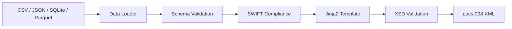

# Pacs008: Automate ISO 20022 pacs.008 FI-to-FI Customer Credit Transfer Messages

## Enterprise-Grade ISO 20022 Interbank Payment XML Generation

[![PyPI Version][pypi-badge]][pypi-url]
[![Python Versions][python-versions-badge]][pypi-url]
[![Licence][licence-badge]][licence-url]
[![Tests][tests-badge]][tests-url]
[![Coverage][coverage-badge]][coverage-url]

## Overview

**Pacs008** is an open-source Python library for creating **ISO 20022-compliant
pacs.008 FI-to-FI Customer Credit Transfer** XML messages from CSV files, JSON,
SQLite databases, or Parquet files.

- **Website:** <https://pacs008.com>
- **Source code:** <https://github.com/sebastienrousseau/pacs008>
- **Bug reports:** <https://github.com/sebastienrousseau/pacs008/issues>

The **pacs.008** message is the interbank equivalent of **pain.001** — it
carries credit transfer instructions between financial institutions. Where
pain.001 initiates a payment from a customer, pacs.008 moves funds between
banks in clearing and settlement networks (TARGET2, SWIFT gpi, SEPA).

### Key Features

- **13 ISO 20022 Versions:** Supports pacs.008.001.01 through pacs.008.001.13
- **Multi-Source Ingestion:** CSV, JSON, JSONL, SQLite, and Parquet
- **XSD Validation:** Every generated XML is validated against its ISO 20022 schema
- **SWIFT Compliance:** Charset validation and field length enforcement prevents silent rejections
- **REST API:** FastAPI-based API with async job management
- **CLI:** Click-based command-line interface for batch processing
- **Secure by Design:** Path traversal protection, `defusedxml` for XXE prevention
- **100% Test Coverage:** 1,050+ tests with full branch coverage
- **Type-Safe:** Strict mypy type checking throughout

### Version Support Matrix

| Version Group | Versions | Identifier | UETR | Mandate | Expiry |
|:---|:---|:---|:---|:---|:---|
| Basic (BIC) | v01–v02 | `<BIC>` | — | — | — |
| BICFI Migration | v03–v04 | `<BICFI>` | — | — | — |
| BICFI Standard | v05–v07 | `<BICFI>` | — | — | — |
| UETR Required | v08–v09 | `<BICFI>` | ✓ | — | — |
| Mandate Support | v10–v12 | `<BICFI>` | ✓ | ✓ | — |
| Full | v13 | `<BICFI>` | ✓ | ✓ | ✓ |

## Installation

### Prerequisites

- Python 3.9.2 or higher
- [Poetry](https://python-poetry.org/) (recommended) or pip

### Install from PyPI

```bash
pip install pacs008
```

### Install from Source

```bash
# Clone the repository
git clone https://github.com/sebastienrousseau/pacs008.git
cd pacs008

# Install with Poetry
poetry install

# Verify installation
python -c "from pacs008 import generate_xml_string; print('OK')"
```

## Quick Start

### Python API

```python
from pacs008 import generate_xml_string

# Prepare payment data (one dict per transaction)
data = [
    {
        "msg_id": "MSG-2026-001",
        "creation_date_time": "2026-01-15T10:30:00",
        "nb_of_txs": "1",
        "settlement_method": "CLRG",
        "interbank_settlement_date": "2026-01-15",
        "end_to_end_id": "E2E-INV-2026-001",
        "tx_id": "TX-001",
        "interbank_settlement_amount": "25000.00",
        "interbank_settlement_currency": "EUR",
        "charge_bearer": "SHAR",
        "debtor_name": "Acme Corp GmbH",
        "debtor_account_iban": "DE89370400440532013000",
        "debtor_agent_bic": "DEUTDEFF",
        "creditor_agent_bic": "COBADEFF",
        "creditor_name": "Widget Industries SA",
        "creditor_account_iban": "FR7630006000011234567890189",
        "remittance_information": "Invoice INV-2026-001",
    }
]

# Generate XML for pacs.008.001.05 (BICFI standard)
xml = generate_xml_string(
    data,
    "pacs.008.001.05",
    "pacs008/templates/pacs.008.001.05/template.xml",
    "pacs008/templates/pacs.008.001.05/pacs.008.001.05.xsd",
)

print(xml)
```

### SWIFT Compliance

```python
from pacs008.compliance import cleanse_data, cleanse_data_with_report

# Raw data with non-SWIFT characters
raw = [{"debtor_name": "Müller & Söhne™", "msg_id": "X" * 50}]

# Option 1: Simple cleanse
clean = cleanse_data(raw)
# clean[0]["debtor_name"] == "Mueller . Soehne."
# len(clean[0]["msg_id"]) == 35  (truncated)

# Option 2: Cleanse with detailed report
clean, report = cleanse_data_with_report(raw)
print(report.summary())
# "2 violations found across 1 row(s) — 1 row(s) modified."
```

### CLI

```bash
# Generate XML from CSV
pacs008 -t pacs.008.001.05 \
  -m pacs008/templates/pacs.008.001.05/template.xml \
  -s pacs008/templates/pacs.008.001.05/pacs.008.001.05.xsd \
  -d payments.csv

# Dry-run (validate only)
pacs008 -t pacs.008.001.05 -m template.xml -s schema.xsd -d data.csv --dry-run

# Verbose output
pacs008 -t pacs.008.001.05 -m template.xml -s schema.xsd -d data.csv --verbose
```

### REST API

```bash
# Start the API server
uvicorn pacs008.api.app:app --host 0.0.0.0 --port 8000

# Health check
curl http://localhost:8000/health

# Validate data
curl -X POST http://localhost:8000/validate \
  -H "Content-Type: application/json" \
  -d '{"data_source": "csv", "file_path": "payments.csv", "message_type": "pacs.008.001.05"}'
```

## Input Data Format

### Required Fields (all versions)

| Field | Description | Example |
|:---|:---|:---|
| `msg_id` | Message identifier (max 35) | `MSG-2026-001` |
| `creation_date_time` | ISO 8601 datetime | `2026-01-15T10:30:00` |
| `nb_of_txs` | Number of transactions | `1` |
| `settlement_method` | CLRG, INDA, or COVE | `CLRG` |
| `interbank_settlement_date` | Settlement date | `2026-01-15` |
| `end_to_end_id` | End-to-end identifier (max 35) | `E2E-INV-001` |
| `tx_id` | Transaction identifier | `TX-001` |
| `interbank_settlement_amount` | Amount | `25000.00` |
| `interbank_settlement_currency` | ISO 4217 currency | `EUR` |
| `charge_bearer` | DEBT, CRED, SHAR, or SLEV | `SHAR` |
| `debtor_name` | Debtor name (max 140) | `Acme Corp` |
| `debtor_agent_bic` | Debtor bank BIC (8 or 11) | `DEUTDEFF` |
| `creditor_agent_bic` | Creditor bank BIC (8 or 11) | `COBADEFF` |
| `creditor_name` | Creditor name (max 140) | `Widget SA` |

### Version-Specific Fields

| Field | Required From | Description |
|:---|:---|:---|
| `uetr` | v08+ | UUID v4 (36 chars) — Unique End-to-end Transaction Reference |
| `mandate_id` | v10+ | Mandate identifier (max 35) |
| `expiry_date_time` | v13 | Message expiry datetime |

## Architecture

```
pacs008/
├── api/              # FastAPI REST endpoints + async job manager
├── cli/              # Click CLI for batch processing
├── compliance/       # SWIFT charset validation & field length enforcement
├── core/             # Main processing pipeline (data → XML)
├── csv/              # CSV loader and validator
├── data/             # Universal data loader (format detection)
├── db/               # SQLite loader (standard + streaming)
├── json/             # JSON/JSONL loader
├── parquet/          # Apache Parquet loader
├── schemas/          # 13 JSON schemas for input validation
├── security/         # Path traversal prevention
├── templates/        # 13 Jinja2 templates + XSD schemas
├── validation/       # BIC, IBAN, and schema validators
└── xml/              # XML generation, XSD validation, file I/O
```



## Development

### Setup

```bash
git clone https://github.com/sebastienrousseau/pacs008.git
cd pacs008
poetry install

# Run tests
poetry run pytest

# Run linting
poetry run ruff check pacs008/
poetry run mypy pacs008/

# Run formatter
poetry run black pacs008/ tests/
```

### Git Commits

All commits **must be signed** with SSH or GPG:

```bash
git config --global gpg.format ssh
git config --global user.signingkey ~/.ssh/id_ed25519
git config --global commit.gpgsign true
```

### Running Tests

```bash
# Full suite with coverage
poetry run pytest tests/ -v

# Specific test file
poetry run pytest tests/test_version_matrix.py -v

# By marker
poetry run pytest -m integration
poetry run pytest -m version_compat
poetry run pytest -m security
```

## Contributing

1. Fork the repository
2. Create a feature branch (`git checkout -b feat/my-feature`)
3. **Sign your commits** (`git commit -S -m "Add feature"`)
4. Ensure tests pass with 99%+ coverage (`poetry run pytest`)
5. Push and open a pull request

## License

Copyright (C) 2023-2026 Sebastien Rousseau.

Licensed under the [Apache License, Version 2.0][licence-url].

<!-- Links -->
[pypi-badge]: https://img.shields.io/pypi/v/pacs008.svg?style=flat-square
[python-versions-badge]: https://img.shields.io/pypi/pyversions/pacs008.svg?style=flat-square
[licence-badge]: https://img.shields.io/pypi/l/pacs008.svg?style=flat-square
[tests-badge]: https://img.shields.io/github/actions/workflow/status/sebastienrousseau/pacs008/ci.yml?label=tests&style=flat-square
[coverage-badge]: https://img.shields.io/codecov/c/github/sebastienrousseau/pacs008?style=flat-square
[pypi-url]: https://pypi.org/project/pacs008/
[licence-url]: https://opensource.org/licenses/Apache-2.0
[tests-url]: https://github.com/sebastienrousseau/pacs008/actions
[coverage-url]: https://codecov.io/gh/sebastienrousseau/pacs008
