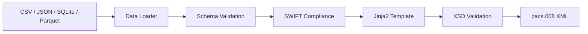

# Pacs008

**ISO 20022 pacs.008 FI-to-FI Customer Credit Transfer XML Generation**

[![PyPI Version][pypi-badge]][pypi-url]
[![Python Versions][python-versions-badge]][pypi-url]
[![Licence][licence-badge]][licence-url]
[![Tests][tests-badge]][tests-url]
[![Coverage][coverage-badge]][coverage-url]

## Overview

Pacs008 generates **ISO 20022-compliant pacs.008 XML messages** from CSV, JSON, SQLite, or Parquet files.

The pacs.008 message carries credit transfer instructions between financial institutions — the interbank counterpart to pain.001. It powers settlement across TARGET2, SWIFT gpi, and SEPA networks.

- [Source code](https://github.com/sebastienrousseau/pacs008)
- [Bug reports](https://github.com/sebastienrousseau/pacs008/issues)

### Features

| Capability | Details |
|:---|:---|
| **Version coverage** | pacs.008.001.01 through pacs.008.001.13 |
| **Data sources** | CSV, JSON, JSONL, SQLite, Parquet |
| **XSD validation** | Every generated XML validated against its ISO 20022 schema |
| **SWIFT compliance** | Charset cleansing, field length enforcement, silent rejection prevention |
| **Interfaces** | Python API, Click CLI, FastAPI REST API |
| **Security** | Path traversal protection, XXE prevention via `defusedxml` |
| **Quality** | 1,400+ tests, 100% branch coverage, strict mypy |

### Version Support Matrix

| Version Group | Versions | BIC Tag | UETR | Mandate | Expiry |
|:---|:---|:---|:---:|:---:|:---:|
| Basic | v01 – v02 | `<BIC>` | — | — | — |
| BICFI Migration | v03 – v04 | `<BICFI>` | — | — | — |
| BICFI Standard | v05 – v07 | `<BICFI>` | — | — | — |
| UETR Support | v08 – v09 | `<BICFI>` | ✓ | — | — |
| Mandate Support | v10 – v12 | `<BICFI>` | ✓ | ✓ | — |
| Full | v13 | `<BICFI>` | ✓ | ✓ | ✓ |

## Installation

Requires **Python 3.9.2+**.

```bash
pip install pacs008
```

Or install from source:

```bash
git clone https://github.com/sebastienrousseau/pacs008.git
cd pacs008
poetry install
```

Verify:

```bash
python -c "from pacs008 import generate_xml_string; print('OK')"
```

## Quick Start

### Python API

```python
from pacs008 import generate_xml_string

data = [
    {
        "msg_id": "MSG-2026-001",
        "creation_date_time": "2026-01-15T10:30:00",
        "nb_of_txs": "1",
        "settlement_method": "CLRG",
        "interbank_settlement_date": "2026-01-15",
        "end_to_end_id": "E2E-INV-2026-001",
        "tx_id": "TX-001",
        "interbank_settlement_amount": "25000.00",
        "interbank_settlement_currency": "EUR",
        "charge_bearer": "SHAR",
        "debtor_name": "Acme Corp GmbH",
        "debtor_account_iban": "DE89370400440532013000",
        "debtor_agent_bic": "DEUTDEFF",
        "creditor_agent_bic": "COBADEFF",
        "creditor_name": "Widget Industries SA",
        "creditor_account_iban": "FR7630006000011234567890189",
        "remittance_information": "Invoice INV-2026-001",
    }
]

xml = generate_xml_string(
    data,
    "pacs.008.001.05",
    "pacs008/templates/pacs.008.001.05/template.xml",
    "pacs008/templates/pacs.008.001.05/pacs.008.001.05.xsd",
)
```

### SWIFT Compliance

```python
from pacs008.compliance import cleanse_data, cleanse_data_with_report

raw = [{"debtor_name": "Müller & Söhne™", "msg_id": "X" * 50}]

# Simple cleanse
clean = cleanse_data(raw)
# clean[0]["debtor_name"] == "Mueller . Soehne."
# len(clean[0]["msg_id"]) == 35  (truncated)

# Cleanse with report
clean, report = cleanse_data_with_report(raw)
print(report.summary())
```

### CLI

```bash
pacs008 -t pacs.008.001.05 \
  -m pacs008/templates/pacs.008.001.05/template.xml \
  -s pacs008/templates/pacs.008.001.05/pacs.008.001.05.xsd \
  -d payments.csv
```

Options: `--dry-run` (validate only), `--verbose` (detailed output).

### REST API

```bash
uvicorn pacs008.api.app:app --host 0.0.0.0 --port 8000
```

```bash
curl http://localhost:8000/health

curl -X POST http://localhost:8000/validate \
  -H "Content-Type: application/json" \
  -d '{"data_source": "csv", "file_path": "payments.csv", "message_type": "pacs.008.001.05"}'
```

## Input Data Format

### Required Fields

| Field | Description | Example |
|:---|:---|:---|
| `msg_id` | Message identifier (max 35) | `MSG-2026-001` |
| `creation_date_time` | ISO 8601 datetime | `2026-01-15T10:30:00` |
| `nb_of_txs` | Number of transactions | `1` |
| `settlement_method` | CLRG, INDA, COVE, or INGA | `CLRG` |
| `interbank_settlement_date` | Settlement date | `2026-01-15` |
| `end_to_end_id` | End-to-end identifier (max 35) | `E2E-INV-001` |
| `tx_id` | Transaction identifier | `TX-001` |
| `interbank_settlement_amount` | Amount | `25000.00` |
| `interbank_settlement_currency` | ISO 4217 currency code | `EUR` |
| `charge_bearer` | DEBT, CRED, SHAR, or SLEV | `SHAR` |
| `debtor_name` | Debtor name (max 140) | `Acme Corp` |
| `debtor_agent_bic` | Debtor bank BIC (8 or 11 chars) | `DEUTDEFF` |
| `creditor_agent_bic` | Creditor bank BIC (8 or 11 chars) | `COBADEFF` |
| `creditor_name` | Creditor name (max 140) | `Widget SA` |

### Version-Specific Fields

| Field | Available From | Description |
|:---|:---|:---|
| `uetr` | v08+ | UUID v4 (36 chars) |
| `mandate_id` | v10+ | Mandate identifier (max 35) |
| `expiry_date_time` | v13 | Message expiry datetime |

## Architecture

```
pacs008/
├── api/              # FastAPI REST endpoints, async job manager
├── cli/              # Click CLI for batch processing
├── compliance/       # SWIFT charset validation, field length enforcement
├── core/             # Processing pipeline: data → XML
├── csv/              # CSV loader and column validator
├── data/             # Universal data loader with format detection
├── db/               # SQLite loader (standard + streaming)
├── json/             # JSON and JSONL loader
├── parquet/          # Apache Parquet loader
├── schemas/          # 13 JSON schemas for input validation
├── security/         # Path traversal prevention
├── templates/        # 13 Jinja2 templates + XSD schemas
├── validation/       # BIC, IBAN, and schema validators
└── xml/              # XML generation, XSD validation, file I/O
```



## Development

```bash
git clone https://github.com/sebastienrousseau/pacs008.git
cd pacs008
poetry install
```

Run checks:

```bash
make test            # Tests with coverage
make test-fast       # Tests without coverage
make lint            # Ruff + Black
make type-check      # mypy
make check           # All of the above
```

All commits must be signed:

```bash
git config --global gpg.format ssh
git config --global user.signingkey ~/.ssh/id_ed25519
git config --global commit.gpgsign true
```

## Contributing

See [CONTRIBUTING.md](CONTRIBUTING.md) for detailed guidelines.

1. Fork the repository.
2. Create a feature branch: `git checkout -b feat/my-feature`
3. Sign commits: `git commit -S -m "feat: add feature"`
4. Ensure tests pass at 99%+ coverage.
5. Open a pull request.

## License

Copyright 2023-2026 Sebastien Rousseau. Licensed under the [Apache License 2.0][licence-url].

<!-- Links -->
[pypi-badge]: https://img.shields.io/pypi/v/pacs008.svg?style=flat-square
[python-versions-badge]: https://img.shields.io/pypi/pyversions/pacs008.svg?style=flat-square
[licence-badge]: https://img.shields.io/pypi/l/pacs008.svg?style=flat-square
[tests-badge]: https://img.shields.io/github/actions/workflow/status/sebastienrousseau/pacs008/ci.yml?label=tests&style=flat-square
[coverage-badge]: https://img.shields.io/codecov/c/github/sebastienrousseau/pacs008?style=flat-square
[pypi-url]: https://pypi.org/project/pacs008/
[licence-url]: https://opensource.org/licenses/Apache-2.0
[tests-url]: https://github.com/sebastienrousseau/pacs008/actions
[coverage-url]: https://codecov.io/gh/sebastienrousseau/pacs008
